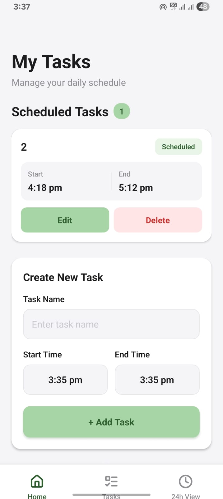
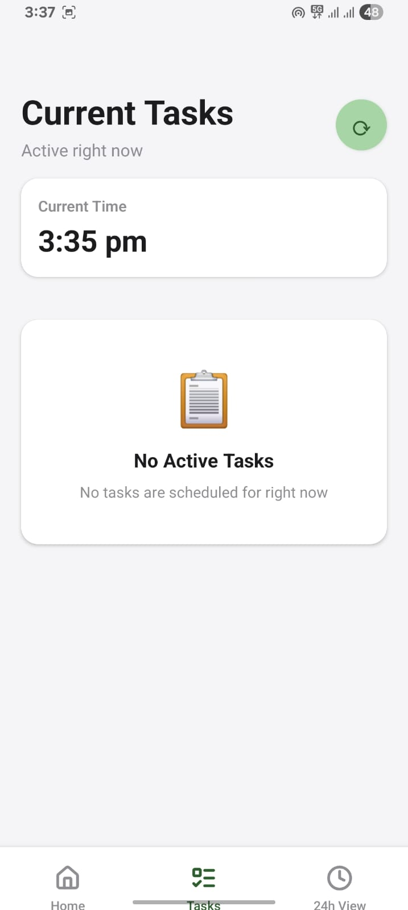
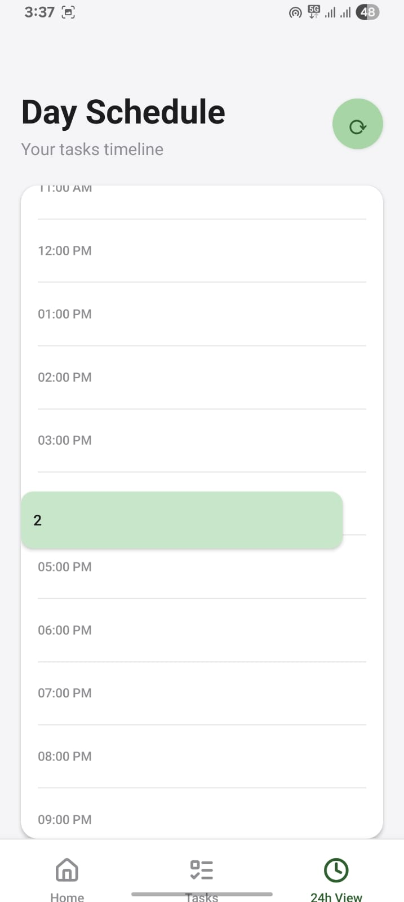

# Time-Blocking & Daily Planning Mobile App

A React Native mobile application focused on **time-blocking, scheduling, and daily planning visualization**.

This project is intentionally designed as a **planning and awareness tool**, not a task-tracking or productivity analytics app.  
It serves primarily as a **technical demonstration** of time-based logic, mobile UI composition, and state management.

---

## Overview

The app allows users to schedule tasks within a day and visualize them across a **24-hour timeline**, while dynamically detecting which task is currently active based on the system time.

The goal of the project is to explore:
- Scheduling logic
- Time-based rendering
- Real-time task evaluation
- Mobile UI architecture

rather than long-term task tracking or productivity metrics.

---

## Core Technical Features

### Scheduling & Time Blocking
- Users can create tasks with explicit **start** and **end** times
- Tasks are constrained within a single day and visualized accordingly

### Current Task Detection
- Real-time detection of the **currently active task**
- Automatically updates based on system time without user interaction

### 24-Hour Timeline Visualization
- A vertical **24-hour timeline** representing the entire day
- Tasks are rendered proportionally based on duration
- Designed to handle dense schedules and partial overlaps

### Overlapping Task Logic
- Detects overlapping time blocks
- Renders overlaps clearly within the same time window
- Layout logic accounts for multiple overlapping tasks

### CRUD Operations
- Create, edit, and delete scheduled tasks
- Immediate UI updates after every operation

### State Synchronization
- Centralized state management ensures:
  - Consistency across screens
  - Accurate reflection of edits and deletions
  - Synchronization between task list, current task view, and timeline

---

## Screenshots


### Home & Task Management



### Current Task Detection


### 24-Hour Timeline View



## Demo Video

A short demo walkthrough showcasing:
- Task creation
- Current task detection
- 24-hour timeline visualization


https://github.com/user-attachments/assets/c3c5dcd9-e7c9-4dcd-9be1-90b3730a670b


▶️ **Demo Video**  
https://drive.google.com/file/d/1cKQQwfibn78DmSS4u5QKfvK_gW9XJqfo/view?usp=drivesdk

---

## Tech Stack

- React Native
- TypeScript
- Expo
- Local persistence (SQLite / local storage)
- Custom time-based layout and rendering logic

---

## Setup Instructions

### Prerequisites
- Node.js (LTS recommended)
- npm or yarn
- Expo CLI
- Android Studio or Xcode (for emulator), or a physical device

### Installation

```bash
git clone https://github.com/<your-username>/<repo-name>.git
cd <repo-name>
npm install

```

### Run the App

```bash 
npx expo start
```


